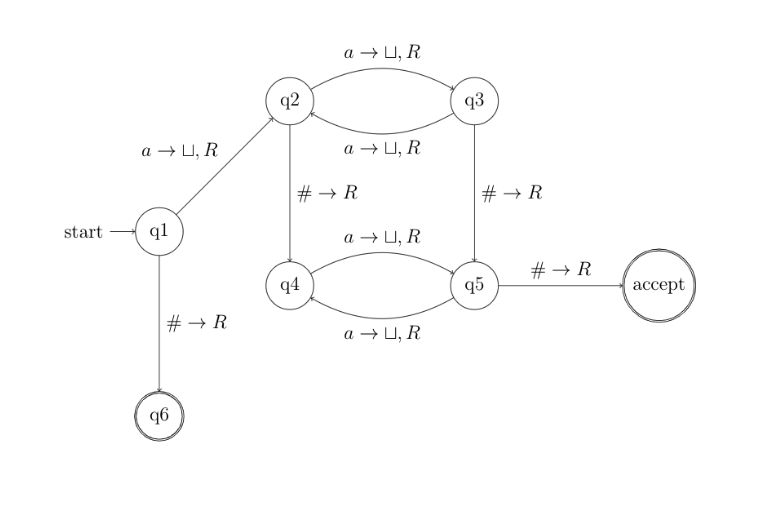

To build on our understanding of Computation, this is a topic I was very excited to talk about. Before you read any further, if 
you have not seen [The Imitation Game](https://www.youtube.com/watch?v=nuPZUUED5uk) then stop reading and find it on Netflix or 
Prime tonight! 📺


## Background

Alan Turing was a mathematician and computer scientist amongst other things. During WW2 he worked for the Government Code and 
Cypher School (GC&CS) at Bletchley Park and was responsible for German naval cryptanalysis.

What I am keen to discuss is the **Turing Machine**, first described in the 1936 paper 'ON COMPUTABLE NUMBERS, WITH AN APPLICATION 
TO THE ENTSCHEIDUNGSPROBLEM'. A _simple_ abstract computational device intended to help investigate the extent and limitations of 
what can be computed. They were first named ‘Turing machines’ by Alonzo Church in a review of Turing’s paper (Church 1937).

> They are considered to be one of the foundational models of computability and (theoretical) computer science.


## Turing Machine

From a high-level a Turing machine is a computing device consisting of a one-way infinite, one-dimensional tape divided into 
squares. Each square is capable of carrying exactly one symbol. At any time, the machine is scanning the content of one square, 
lets call it `r`, which is either blank (symbolised by `S0`) or contains a symbol `S1,…,Sn` with `S1=0` and `S2=1`.

Formally a Turing machine can be specified as a quadruple `T = (Q,Σ,S,δ)` where;
- `Q` is a finite set of states `q`
- `Σ` is a finite set of symbols
- `S` is the initial state `S ∈ Q`
- `δ` is a transition function determining the next move: `δ:(Q×Σ) → (Σ × {L,R} × Q)`

The beauty of a Turing Machine is the unlimited and unrestricted memory, it is a much more accurate model of a general purpose 
computer.

Fundamentally, a Turing Machine can do everything that a real computer can do. 

Some fundamental of a Turing Machine; 
1. A Turing Machine can both write and read from the tape
2. The read-write head of the tape can move left and right
3. The tape is infinite
4. The _accept_ and _reject_ states take effect immediately


## Implementation

You may be asking, "that's cool, what problems could we solve?"

Consider a language which took n nunber of a's before and after a `#` symbol, such that there is equal parity. Parity means odd or even, 
so the language only includes strings where both parts are odd or both parts are even.

The mathematical notation for this language; `𝐿 = {u#v| u, v ∈ {𝑎}, u and v have the same parity}`.

Some valid strings would be:
- `aa#aa`
- `aaa#aaa`
- `aaaaaa#aaaaaa`

This is what the Turing Machine for this problem would look like;



The annotation on arrows between states shares three pieces of information;
- on what letter the move to the new transition happens 
- what is written to the tape
- the direction to move on the tape 

The transition from `q1` to `q2` is described by `a → ⊔, R`. Meaning we move to state `q2` when we read `a` on the tape. We will 
write `⊔` to the tape which denotes an empty string. When there is no character after the arrow `→` we don't write anything. 
The very last notation is the direction, here we will move one step to the right `R`.

Reading the first character in the string `aaa#aaa`, we will transition from `q1` to `q2` write `⊔` to the tape and move to the 
right like so;

```
state: q1
[a][a][a][#][a][a][a][ ]..
 ^

state: q2
[⊔][a][a][#][a][a][a][ ]..
    ^

state: q3
[⊔][⊔][a][#][a][a][a][ ]..
       ^

state: q2
[⊔][⊔][⊔][#][a][a][a][ ]..
          ^

state: q4
[⊔][⊔][⊔][#][a][a][a][ ]..
             ^

state: q5
[⊔][⊔][⊔][#][⊔][a][a][ ]..
                ^

state: q4
[⊔][⊔][⊔][#][⊔][⊔][a][ ]..
                   ^

state: q5
[⊔][⊔][⊔][#][⊔][⊔][⊔][ ]..
                      ^

state: accept

```

Based on the Turing Machine we have designed, the language is said to be **Turing-recognisable**.

Follow the diagram and work across the string or any other example to see how we get to the accept state. We have another accept 
state at `q6` which is denoted with the double circle.


## Time Complexity

The Big O notation complexity for this machine is: `O(n)`. The input string is scanned across once, there are no repetitive 
scans over the input string.

The Big O notation and time complexity to describe algorithmic performance is something I will write about in a future post. 
It's an interesting topic I don't want to quickly cover.


## Multitape Turing Machines

When we move towards multi-tape Turing Machines, the benefits/ power of Turing Machines are more apparent. Each tape has its own 
head for reading and writing. Initially, the input appears on tape one and the others start blank. The transition function allows 
for reading, writing and moving the heads on one or more of the tapes simultaneously.


## Computable Numbers 

Alan Turing’s original work focused on computable (real) numbers.

A (real) number is said to be **Turing computable** if there exists a Turing machine which computes an arbitrarily precise 
approximation to that number. All of the algebraic numbers (roots of polynomials with algebraic coefficients) and many 
transcendental mathematical constants, such as `e` and `π` are Turing-computable.

Turing machines capture all general and effective procedures which determine whether something is the case or not. 

These problems are of the form; `decide for any given x whether or not x has property Y`

Good examples of such problems are:
- `decide for any given x whether or not x denotes a prime`
- `decide for any given x whether or not x is the description of a Turing machine.`


## The Halting Problem and the Entscheidungsproblem

The Halting Problem is the problem of determining, from a description of an arbitrary computer program and an input, whether 
the program will finish running, or continue to run forever. 

Take for instance;

```cs
  public void KeepGoing()
  {
      while (true)
      {
          Console.WriteLine("Do I halt?");
      }
  }
```

Alan Turing proved that a general algorithm to solve the halting problem for all possible program-input pairs cannot exist.

In the 1920's the Germain mathematician David Hilbert presents the following question to the mathematical community: 
> Is there a procedure that takes any first-order logic statement and decides whether it’s universally valid?

By universally valid we mean valid for every input.

Hilbert wrote a collection of [23 problems](https://en.wikipedia.org/wiki/Hilbert%27s_problems), published in 1900. 
Maybe the reason why Jordan wears that number? 👀

These questions and their solutions could easily have their own post, I won't go into detail here. 😊


## Impact on Computer Science

Alan Turing is highly regarded as one of the fathers of Theoretical Computer Science, its evident more so when you consider 
the main award in the computer science community is called the **Turing** award.

Many of Turing’s contributions, are today considered as pioneering. The 1936 paper on Turing machines has had the largest impact 
on computer science.

Thanks for your time and if you have made it this far let me know what you thought! 

Pratik Thanki ✌️
