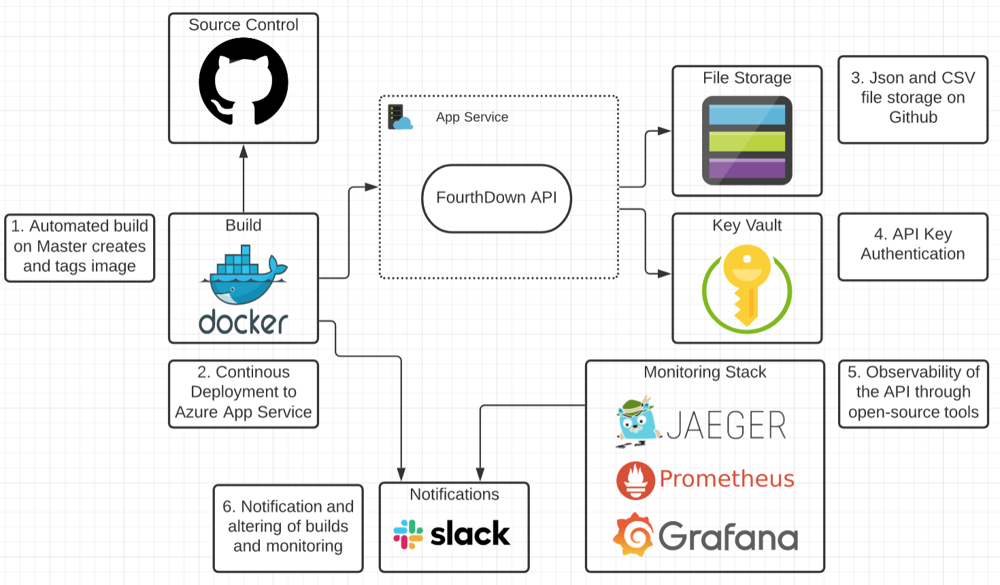

Over the last few weeks I have been working on an open and extensible API for NFL play-by-play data 
for users of all tools/technologies and languages.

The FourthDown API is organised around the HTTP [REST](https://en.wikipedia.org/wiki/Representational_state_transfer) 
protocol and has predictable resource-oriented URLs and returns [JSON-encoded](http://www.json.org/) responses,
and uses standard HTTP response codes, authentication, and verbs.

The API can be used to get NFL schedule and team details, as well as different types of play-by-play 
game data. The API is designed with the primary goal of being language/tool agnostic, a shortfall in NFL 
data resources currently available. Most endpoints share the same set of base query parameters: 
`GameId`, `Season`, `Team` and `Week`.

The API is documented in **OpenAPI format** and supported by a few 
[vendor extensions](https://github.com/Redocly/redoc/blob/master/docs/redoc-vendor-extensions.md).

The API is designed and built on [ASP.NET Core](https://docs.microsoft.com/en-us/aspnet/core/introduction-to-aspnet-core?view=aspnetcore-5.0) 
and utilises the [Repository Pattern](https://deviq.com/repository-pattern/). An aspect of this that was 
fun was designing the API with maintainability in mind. It also meant applying sound architectural 
[design principles](https://docs.microsoft.com/en-us/dotnet/architecture/modern-web-apps-azure/architectural-principles).

Brief overview of the architecture I put together, leveraging open-source (❤️) and tools I'm familiar with.



## Getting Started

You can create an api key using the `/api/auth` endpoint and pass a value to the `name` query parameter.

An example request looks like this:

```shell

POST /api/auth?name=bob

```

The response from this request will look like this:

```json

{
  "key": "0fw1d8a8-f627-4a93-8ef7-294447ge5292",
  "name": "bob",
  "creationDateTime": "2020-12-22T09:27:27.899348Z",
  "expirationDateTime": "2020-12-29T09:27:27.8993712Z"
}

```

Don't want to query the API or create a key? That's fine!

You can pull the Docker image from the public [dockerhub](https://hub.docker.com/repository/docker/pratikthanki9/fourthdown-api) 
repository and run the container locally:

```shell

$ docker pull pratikthanki9/fourthdown-api:latest

$ docker images

REPOSITORY                        TAG         IMAGE ID        CREATED      SIZE
pratikthanki9/fourthdown-api      latest      f50f9524513f    1 days ago   85.1 MB

$ docker run pratikthanki9/fourthdown-api:latest

```

Or you can add it to your docker-compose and spin it up with other service, an example could look like this:

```yml

version: '3.4'

services:
  api:
    image: fourthdown-api:latest
    container_name: fourthdown-api
    ports:
    - 5000:5000

```

And then `docker-compose up -d` from where your compose file is. You can then query the api with: `http://localhost:5000`

Shoutout to the guys of the R package [nflfastR](https://github.com/mrcaseb/nflfastR) 
([Ben Baldwin](https://twitter.com/benbbaldwin) and [Sebastian Carl](https://twitter.com/mrcaseb)) on 
the game data and modelling of EPA, WP and CPOE and many other data points and the raw data files. 
[Lee Sharpe](https://twitter.com/LeeSharpeNFL) too for the game schedule data going back to 1999.

You can reach out to me on [Twitter](https://twitter.com/pratikthanki) with any feedback or questions. Should you 
have any thoughts, questions, bugs or suggestions on the FourthDown API you can also raise an 
[Issue](https://github.com/pratikthanki/FourthDown/issues) with details and I will aim to fix or expand capabilities!

You can see more details about the endpoints on the [FourthDown API Docs](https://fourthdown.azurewebsites.net/).

Pratik Thanki ✌️
