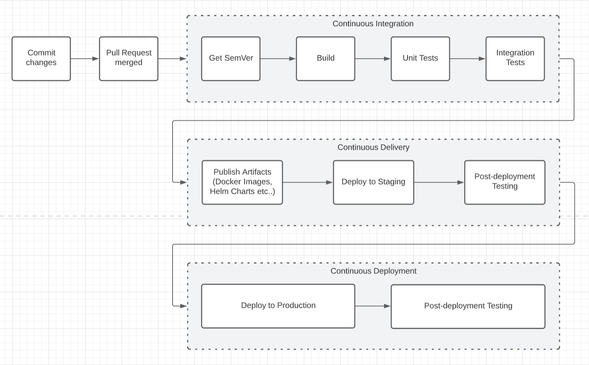

A huge part of the engineering process is streamlining the journey from code written on a 
developers machine and production, and by extension, in front of the user. Here, we will touch 
on several concepts from; Agile, CI/CD/CD and Semantic Versioning and how they all compliment 
each other in building an engineering culutre and processes to work faster.


## Agile

The speed and velocity at which development work is shipped has increased in the last 20 years 
becuase of advances in technology amongst other reasons. We can see how this also resulted in 
changes in how teams organise, plan and execute work - i.e. the rising popularity of Kanban as 
an agile methodology.

**Kanban** is all about maximizing efficiency (or flow) while limiting work in progress. Team 
focus is aligned on reducing the time from picking up a story to finishing. This is done using 
a kanban board and continuously improving flow of work.

**Scrum** teams commit to completing an increment of work, which is potentially shippable, 
through set intervals called sprints. The goal is to create feedback loops to quickly gather 
and integrate customer feedback. Scrum teams adopt specific roles, create release artifacts, 
and hold regular ceremonies to keep things moving forward.


## Continuous Concepts

Further to this, technology has seen the rise in "CI/CD". The "CI" aspect of that is referred 
to as **continuous integration**, which means new code changes are regularly built, tested, 
and merged to a shared repository as part of an automated pipeline/process. It’s a solution 
to the all too common problem of having too many branches and defferring conflicts to the end 
of the development process. Here, think about integration/ regression tests lasting hours and 
running overnight on a special "release" branch.

While, "CD" can be referred to as continuous delivery and/or continuous deployment. The concepts 
are related and used interchangeably. Both concepts are about futher automation in the pipeline 
but mean different things in terms of what is happening. It also is a great demonstration of the 
degree of automation happening.

**Continuous delivery** usually means changes to an application are automatically bug tested and 
that an artifact has been uploaded to a repository (like GitHub or a container registry), where 
they can be deployed. It’s a means for development to communicate with the business as to what is 
ready to ship. Based on that logic, the purpose of continuous delivery is to minimise the effort 
to deploy new code.

**Continuous deployment** (the other possible "CD") is where things get __very__ interesting. It 
is referred to automatically deploying a developer’s changes to production. It addresses the 
problem of overloading operations teams with manual processes that slow down app delivery. It 
builds on the benefits of continuous delivery by automating the next stage in the pipeline.


## Semantic Versioning

Anyone who has worked on large-scale projects either microservices or enterprise architectures 
and things in between one problem teams face is "dependency hell". In short:

> The bigger your system grows and the more packages you integrate into your software, the more likely you are to find yourself, one day, in this pit of despair.

A more in-depth post will follow but in summary the complexity in managing dependencies can cause 
issues and result in more effort that could be spent on application development. As such, one of 
the most widely used techniques to combat this is the 
[Semantic Versioning Specification (SemVer)](https://semver.org/) - creating a public API the 
version number is detailed as `MAJOR.MINOR.PATCH`.


## Example Implementation

There are many ways to define versions based on the language being used, for instance, in the 
.NET ecosystem the MSBuild process can be customised with a `Directory.Build.props` file. 

In this case, we will cover a language agnostic approach. Start-off by defining a `Version.xml` 
in your project directory:

```xml

<!-- 
Given a version number MAJOR.MINOR.PATCH, increment the:
- MAJOR version when you make incompatible API changes,
- MINOR version when you add functionality in a backwards compatible manner, and
- PATCH version when you make backwards compatible bug fixes. 
-->

<Project>
    <Version>1.0.0</Version>
</Project>

```

In the CI/CD pipeline the file and version can be accessed with your favourite scriting language. 
Below is an example with powershell which takes a directory as a command line arguement:

```ps1

[CmdletBinding()]
param (
    [Parameter(Mandatory=$true)] [ValidateNotNullOrEmpty()] [string] $PATH_TO_PROJECT
)

try {
    $PATH = Join-Path $PATH_TO_PROJECT 'Version.xml'
    [xml]$xmlElement = Get-Content -Path $PATH

    $VERSION = $xmlElement.Project.Version

    # Sometimes the value needs to be shared with other stages/steps/jobs 
    # in a pipeline. Some examples below on how to do this:

    # GitHub Actions
    Write-Host "::set-output name=VERSION::${VERSION}"

    # Azure DevOps
    # Write-Host "##vso[task.setvariable variable=VERSION;isoutput=true]${VERSION}"

    # Team City
    # Write-Host "##teamcity[setParameter name='VERSION' value=${VERSION}]"

    # Jenkins
    # Write-Host VERSION=$VERSION
}
catch {
    Write-Error "Error occurred in retrieving Version.."
}

```

More broadly, when we put the above together - the use of semantic versioning, continuous 
integration and continuous delivery principles form the foundation of a continuous deployment 
engineering environment.

The below summarises this point and a depiction of a CI-CD pipeline:



I have a practical example of these principles in action with my own NFL play-by-play 
API - [FourthDown](https://fourthdown.azurewebsites.net/). View runs on [GitHub Actions](https://github.com/pratikthanki/FourthDown/actions/workflows/dotnet-core.yml) and the configuration - [dotnet-core.yml](https://github.com/pratikthanki/FourthDown/blob/main/.github/workflows/dotnet-core.yml).

If you've enjoyed reading this post and would like to learn more about CI/CD, here are some 
further readings that maybe useful:
- [Continuous integration vs. continuous delivery vs. continuous deployment](https://www.atlassian.com/continuous-delivery/principles/continuous-integration-vs-delivery-vs-deployment)
- [What is CI/CD?](https://www.redhat.com/en/topics/devops/what-is-ci-cd#ci-vs-cd)
- [Understanding the CI/CD Pipeline: What It Is, Why It Matters](https://www.plutora.com/blog/understanding-ci-cd-pipeline)
