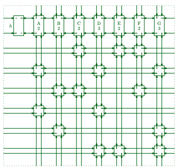

Over the last month (or so) I tasked myself with solving a Sudoku puzzle in C#. Talking to a friend, he mentioned "Algorithm X" 
and Donald Knuth. Doing more research and watching [lectures](https://www.youtube.com/watch?v=_cR9zDlvP88) on the topic I began 
to understand Dr. Donald Knuth’s Dancing Links Algorithm and how it could be used to solve the Sudoku puzzle.

In my reading I came across the Exact Cover Problem and how those principles can be applies to the Sudoku.


## What is an Exact Cover Problem?

Consider a matrix of 0s and 1s, the Dancing Links will find one or more sets of rows which only contain a single 1 in 
each column. In Knuth’s [paper](https://arxiv.org/abs/cs/0011047) this is the example given;

Given a matrix of 0s and 1s, does it have a set of rows containing exactly one 1 in each column?

```
0 0 1 0 1 1 0
1 0 0 1 0 0 1
0 1 1 0 0 1 0
1 0 0 1 0 0 0
0 1 0 0 0 0 1
0 0 0 1 1 0 1
```

The matrix has a set with rows 1, 4 and 5.

This is a tough problem and well known to be [NP-complete*](https://en.wikipedia.org/wiki/NP-completeness) 
even when each row contains exactly three 1s.

**this means that the problem can be solved in polynomial time (`O(n^k)`) using a non-deterministic Turing Machine.

Given a matrix `A` of 0s and 1s, Knuth states;

If `A` is empty, the problem is solved; terminate successfully.<br />
Otherwise choose a column, `c` (deterministically).<br />
Choose a row, `r`, such that `A[r, c] = 1` (nondeterministically).<br />
Include `r` in the partial solution.<br />
For each `j` such that `A[r, j] = 1`,<br />&nbsp;&nbsp;&nbsp;&nbsp;
  delete column `j` from matrix `A`;<br />&nbsp;&nbsp;&nbsp;&nbsp;
  for each `i` such that `A[i, j] = 1`,<br />&nbsp;&nbsp;&nbsp;&nbsp;&nbsp;&nbsp;&nbsp;&nbsp;
    delete row `i` from matrix `A`.

Repeat this algorithm recursively on the reduced matrix `A`.

The algorithm clones itself into independent subalgorithms because of the nondeterministic selection of `r`. Each subalgorithm 
inherits the current matrix `A`, but reduces it with respect to a different row r.

If column c is entirely zero, there are no sub-algorithms and the process terminates unsuccessfully.

The subalgorithms form a search tree in a natural way, with the original problem at the root and with level k containing 
each subalgorithm that corresponds to k chosen rows. 

Backtracking is the process of traversing the tree in pre-order, “depth first.”


## Backtracking

Briefly, Backtracking is the traditional approach to solving the Sudoku puzzle. 

The notion of satisfying constraints across;
- rows
- columns 
- "subboard"
- the square value (commonly 1-9)

This is a recursive method (`Solve`) which sets the value and continues to be called when the value satisfies all constraints.

The `GetNeighbours` method returns a list of other other values based on the above contrainsts that are no longer available.


``` csharp
  public class Backtrack
  {
      private readonly Board _board;
      private int steps;
      private Stopwatch _stopwatch;

      public Backtrack(Board board)
      {
          _board = board;
          steps = 0;
          _stopwatch = new Stopwatch();

          _board.PrintBoard();
          _stopwatch.Start();
      }

      public bool Solve()
      {
          for (var row = 0; row < 9; row++)
          {
              for (var column = 0; column < 9; column++)
              {
                  var currentSquare = _board.GetBoardSquare(row, column);
                  if (!currentSquare.IsEmpty())
                      continue;

                  for (var number = 1; number <= 9; number++)
                  {
                      var placedValues = GetNeighbours(currentSquare);

                      if (!IsValidMove(placedValues, number))
                          continue;

                      currentSquare.SetValue(number);
                      steps++;

                      if (Solve())
                          return true;

                      currentSquare.SetValue(0);
                  }

                  return false;
              }
          }
          _stopwatch.Stop();
          _board.PrintBoard();
          Console.WriteLine($"Steps: {steps}; Time taken: {_stopwatch.ElapsedMilliseconds}ms");
          return true;
      }

      private IEnumerable<BoardSquare> GetNeighbours(BoardSquare currentSquare)
      {
          var Row = currentSquare.GetRowIndex();
          var Column = currentSquare.GetColumnIndex();
          var SubBoard = currentSquare.GetSubBoard();

          var PlacedValues = new List<BoardSquare>();
          PlacedValues.AddRange(_board.GetRow(Row));
          PlacedValues.AddRange(_board.GetColumn(Column));
          PlacedValues.AddRange(_board.GetSubBoard(SubBoard));
          return PlacedValues;
      }

      private static bool IsValidMove(IEnumerable<BoardSquare> placedValues, int number)
      {
          return placedValues.All(value => !value.GetValue().Equals(number));
      }
  }
```

## Dancing Links

The algorithm leverages the basic principle of doubly-linked lists.

Double linked lists contain an extra pointer (or node) compared to (singular) linked lists, it includes; 
- the previous node 
- the next node and
- the data

The benefit is the ability to see the next and previous nodes relative to the current pointer.

The dancing links method combined with the exact cover "matrix" is what allows you to implement Algorithm X to a binary matrix 
(or matrices to be precise).

We create a quadruple chained data structure with refereces to `Left`, `Rigth`, `Up` and `Down` positions. Below is the 
representation of the exact cover matrix from Knuth's paper.



The common operations in the application of Algorithm X mean you manipulate the data in the doubly linked list nodes. Suppose `x` 
points to an element of a doubly linked list; let `L[x]` and `R[x]` point to thepredecessor and successor of that element.

These operations remove `x` from the list;

```text
L[R[x]] ← L[x] 

R[L[x]] ← R[x]

```

The following put `x` back into the list;

```text
L[R[x]] ← x

R[L[x]] ← x

```

The running time of Algorithm X is proportional to the number of times data is added/updated or removed from nodes via the two operations.

In my next post I'll go into more detaila around the application and implementation in C#! 

Thanks for reading, if you have any questions/queries feel free to reach out. 

Read more details from Knuth’s [paper](https://arxiv.org/abs/cs/0011047) which I have refereced in this post.


