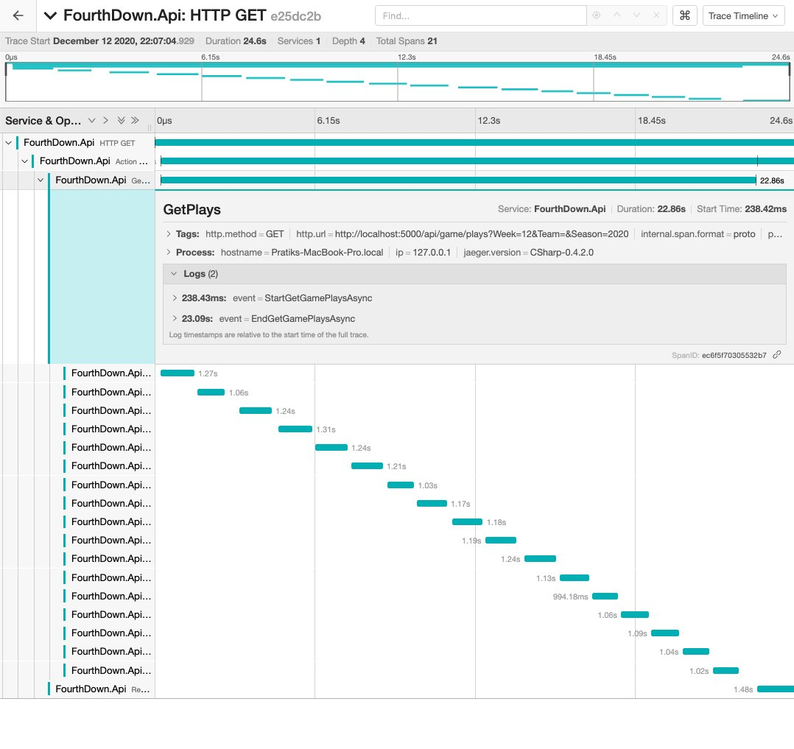
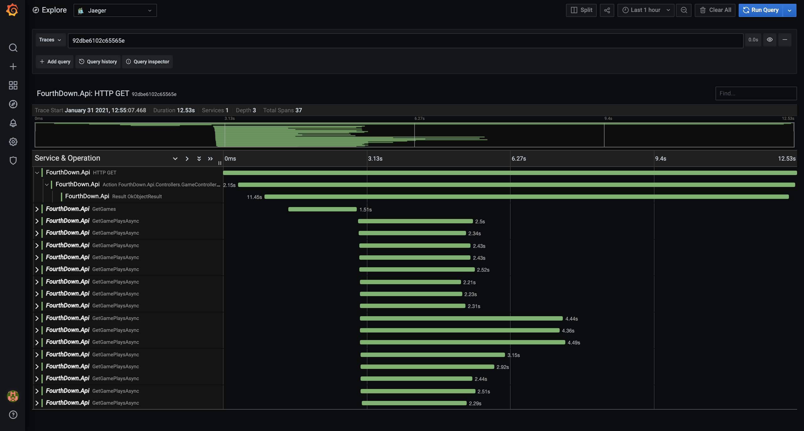
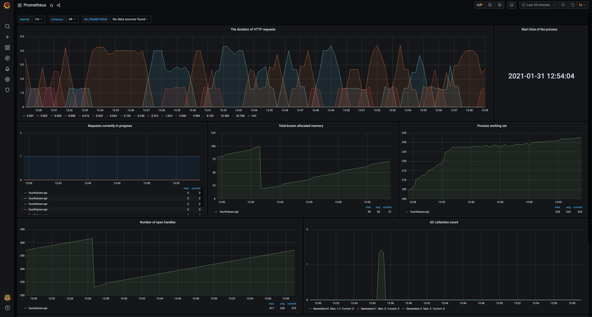

On the back of the Grafana [announcement](https://twitter.com/pratik_thanki/status/1350459889391435776) earlier 
this year I was excited to use the new free [Grafana Cloud](https://grafana.com/products/cloud/?pg=hp&plcmt=hero-btn1) 
to monitor my NFL play-by-play API - [FourthDown](https://fourthdown.azurewebsites.net/). In this post I'll cover 
how I use Grafana Cloud to proactively monitor performance, the powerful capabilities of [Prometheus](https://prometheus.io/) and 
[Jaeger](https://www.jaegertracing.io/) in my observability stack.

## Background

Application observability is built on three key components:

- **Logging**: information about events happening in the system, this can vary from instances of throwing out of memory 
exceptions and app configuration on startup not reflecting expected values. Useful for getting a complete understanding 
of what has occurred in the system.

- **Tracing**: information about end-to-end requests received by the system. A trace is similar to a stack trace spanning 
multiple applications. Traces are a good starting point in identifying potential bottlenecks in application performance. 
Like asynchronous web requests, serialization or data processing.

- **Metrics**: real-time information of how the system is performing. KPIs can be defined to build alerts, allowing for 
proactive steps when performance degrades. Compared to logs and traces, the amount of data collected using metrics 
remains constant as the system load increases. Application problems are realized through alerting when metrics exceed 
some threshold. For example, CPU usage being higher than before, increase in 5xx requests or average response times.

You can read more about Grafana Clound integrations in this blog 
[post](https://grafana.com/blog/2021/01/13/how-to-get-started-quickly-with-metrics-logs-and-traces-using-grafana-cloud-integrations/?src=tw&mdm=social).

## Best Practices

It can be daunting to find and define application metrics, two well-known methods for what metrics to add to a 
given system are defined below.

The **USE** method for resources - channels, queues, CPUs, memory, disks, etc.

- Utilization: some time aggregation (median, average, percetile) that the resource was busy (e.g., disk at 90% I/O utilization)
- Saturation: the extent to which work/tasks are queued (or denied) that can’t be serviced (e.g. queue length for incoming messages)
- Errors: count of errors and by type (4xx, 5xx, etc.)

The **RED** method for request-handling services:

- Rate
- Error Rate 
- Durations (or distribution)

You can read more about each [here](https://grafana.com/blog/2018/08/02/the-red-method-how-to-instrument-your-services/), there 
are a number of Prometheus-specific instrumentation [best practices](https://prometheus.io/docs/practices/instrumentation/).

Another popular method defined by Google's Site Reliability Engineering book is the 
[The Four Golden Signals](https://sre.google/sre-book/monitoring-distributed-systems/#xref_monitoring_golden-signals)

The books mentions,_"If you can only measure four metrics of your user-facing system, focus on these four."_:

- Latency: the time it takes to serve requests
- Traffic: measure of demand placed on the application or service
- Errors: the rate of requests that fail
- Saturation: how “full” your service is

_"If you measure all four golden signals and page a human when one signal is problematic (or, in the case of saturation, nearly problematic), your service will be at least decently covered by monitoring."_

## Tracing

Leveraging tracing allowed me to find and remove bottlenecks that impacted end-user performance. In this example, 
multiple HTTP web requests can be performed asynchronously through `System.Threading.Tasks`:

Request performance was not at the level I was aiming for. Upon examining request traces I realized the synchronous manner of 
web requests:

Executing requests through `Task.WhenAll` will complete when all of the supplied tasks have completed. This significantly 
improved response times and resulted in the following trace:

The Grafana-Jaeger integration view:

## Monitoring

Combining the methods described above and the capabilities of libraries available for [ASP.NET Core](https://docs.microsoft.com/en-us/aspnet/core/?view=aspnetcore-5.0) 
allowed me to create optimal dashboards.

## Takeaways 

Getting started with Grafana Cloud intrigued me to look further into further aspects of monitoring and appreciate the open-source observability 
eco-system; from Prometheus, Jaeger and Grafana. Not to mention other frameworks and libraries I didn't use for this project. You can read more 
here on observability in [ASP.NET Core](https://devblogs.microsoft.com/aspnet/observability-asp-net-core-apps/).

Getting started with the API in any language is super simple, you can read this post with code snippet - [FourthDown API Samples](../fourth-down-api-samples).

Thanks for reading!

