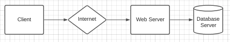
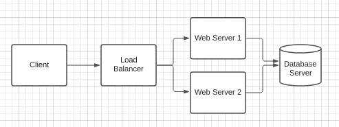
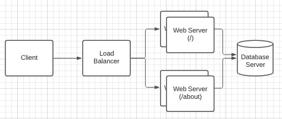
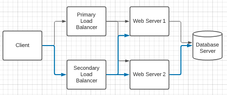

Working with web services in a microservices architecture is so cool and part of that something I have learned and read about 
is load balancing and HAProxy.

HAProxy, which stands for High Availability Proxy, is a popular open source software TCP/HTTP Load Balancer and proxying solution. 

Whether you're working in a microservices architecture with web services or something else, this is an important component that 
handles distribution and workload of client requests. It is most commonly used to improve the performance and reliability of a 
server environment (e.g. web, application, database).

I'll start with some useful terminology and concepts associated with HAP that is useful to know.

Access Control List (ACL) provides a flexible solution to perform content switching and testing some condition. This can be from:
- content extracted from the request, the response 
- any environmental status
- pattern-macthing
- and the number of connections to a server

Other terms that are important is **backend** and **frontend**.

From a highlevel, a *backend* is a set of servers that receives forwarded requests. A **frontend** defines how requests should be 
forwarded to backends (i.e. take a client/user request and send it to the appropriate service). This is very high-level, there is 
and can be more to this! 

_Spoiler: this is were things get interesting!_

## Load Balancing

There are several types of load balancing an application can implement. Broadly, this is the process of methodical and efficient 
distributionof network or application traffic. 

A simple example with **no load balancer**:

The client connects directly with the web server, with no load balancer if your web server goes down the entire service is 
compromised.

The simplest form of load balancing is **layer 4 load balancing**  . The clients request is forwarded by the load balancer to the 
appropriate backend.

Load balancing in this way will forward requests based on IP range and port.

Layer 4 load balancing uses information defined at the networking **transport layer** for deciding how to distribute worload 
across a group of servers.

Building on this, a more complex way of load balancing is application layer or **layer 7 load balancing**. 

Based on the client request, the load balancer will direct messages to the respective backend web-servers.

This form of load balancing allows you to run multiple web-servers under the same domain:port.

In this example requests to the endpoints `/` and `/about` are directed to separate sets of backend web-servers.

## Load Balancing Algorithms

We've spoken about what load balancing is and what it can look like, but how do we determine which server to direct requests to?

HAProxy offers several options for algorithms.

Servers can be assigned a weighting to control how frequently the server is selected as welll as a load balancing algorithm.

There are many different algorithms, the most common include:
- roundrobin: selects servers in turns
- leastconn: selects the server with the least number of connections
- source: selects which server to use based on a hash of the client/request IP

## Health Checks

Health checks are vital in being aware of the applications state. From an operations point of view this can alleviate the need to 
restart or remove servers from application backends. 

A common health check is to extablish a TCP connectioon to the server. 

If a server fails a health and therefore unable to server requests it is disabled in the backend. 

Other backend servers like databases are more difficult to determine by conventional health checks becauase of transient 
errors as one example.

As you may have realised from my poorly drawn lucid charts, the load balancer has become an inadvertent single point of failure, 
even with multiple backend servers (both in layer 4 and layer 7 load balancing).

A high availability (HA) setup is an infrastructure that looks to negate this shortcoming. 

By adding redundancy in the form of a secondary/passive load balancer, it prevents a single server failure from being a critical 
incident that could affect client access. 

Ironicallly, just as a load balancer facilitates redundancy for the backend layer (web/app servers), a passive load balancer 
provides redundancy for itself.

This is an example of a high-availability setup:

In this example, you have multiple load balancers (one primary and one passive/secondary) behind a static IP address that can be 
remapped from one server to another. The client request goes through the external IP address to the active load balancer.

If that load balancer fails, your failover mechanism will detect it and automatically reassign the IP address to one of the 
passive servers. There are other (more sophisticated) ways to implement High Availability setups, this is a simple example.

Thanks for reading!

Pratik Thanki ✌️
