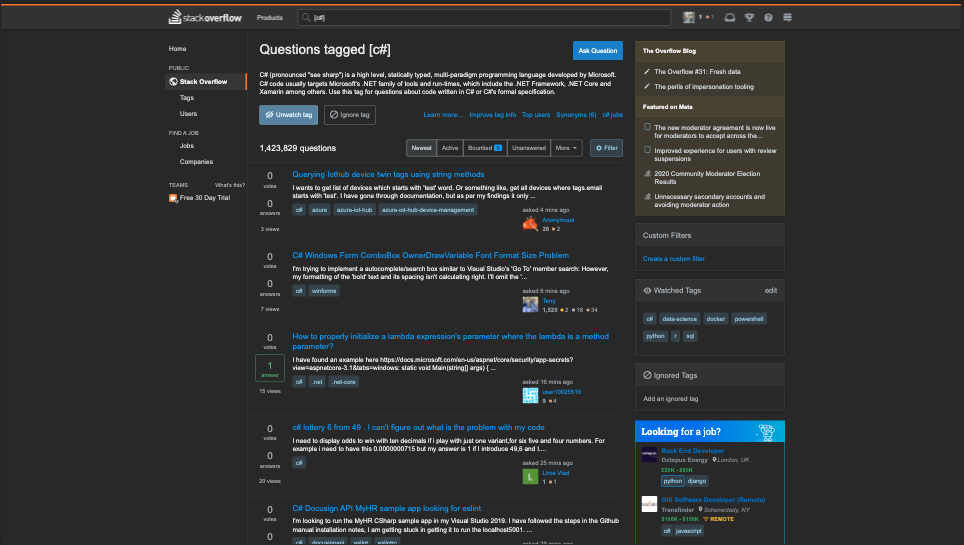
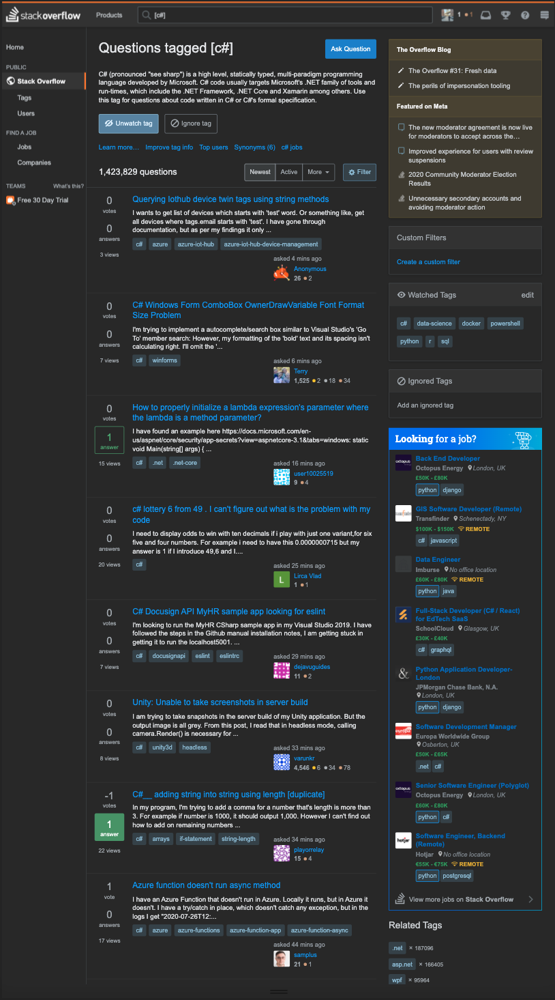
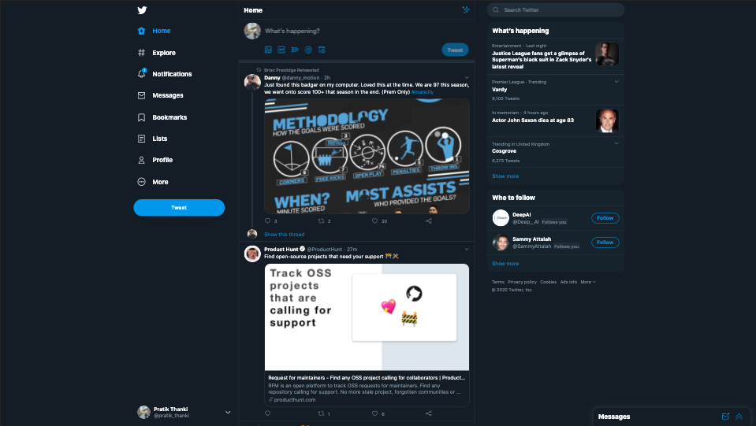
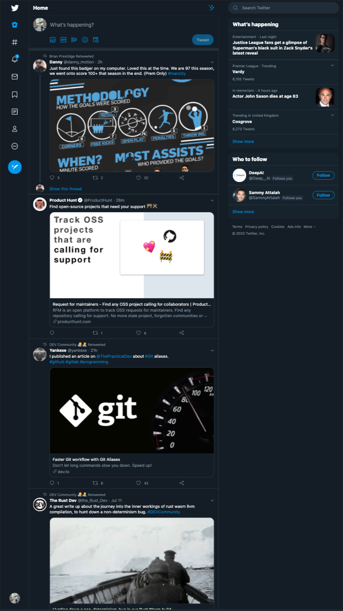

I recently replied to a tweet by [Product Hunt](https://twitter.com/pratik_thanki/status/1286950411107291136) 
sharing my WFH set-up. I have two [Dell P2419H](https://www.amazon.co.uk/Dell-P2419H-Monitor/dp/B07FDNTS33) monitors in the 
vertical orientation, with my 13 inch MacBook Pro tucked away on the side.

I got a couple questions/ comments around the set-up. 

TL;DR, yes this set-up has many benefits and worth doing!

Three Dell P2419H monitors (dimensins = 21.27 x 6.54 x 14.02 inches), all set-up "normally" would be pushing the 
boat at your ability to see/ notice the contents of each screen without turning your head too much.

- Horizontal = 63.81 inches
- Vertical = 42.06 inches

Considering [field of view](https://www.ncbi.nlm.nih.gov/books/NBK220/), at it highest your peripheral vision may 
be in the region of 100 degrees. This means you won't see everything on your screen and often attention is focused on one screen 
and the others will containd distractions.

Looking more closely at the numbers, for a space efficiency view, the same space required for three horizontal monitors would allow 
you to fit **four** vertical ones. How is that a bad thing?

The type of work you do also impacts the benefits of a vertical set-up with more content fitting down the page. From reading code, 
docs or even browsing Google/ StackOverflow you will be able to see more.

My desk in the office included three horizontal monitors. During lockdown I had to commit to a vertical set-up if I wanted the second screen. 
I spent a week with a screen set vertically and my laptop and loved it instantly! Now, I couldn't imagine reverting from this!

Here are some examples that really show me that the internet was designed to be viewed vertically!

## StackOverflow

## Twitter

Don't take my word on this. Rotate your screen and try working with it for a full work week. It will feel strange initially, 
but after a few days you'll get use to it and really see the benefits.

